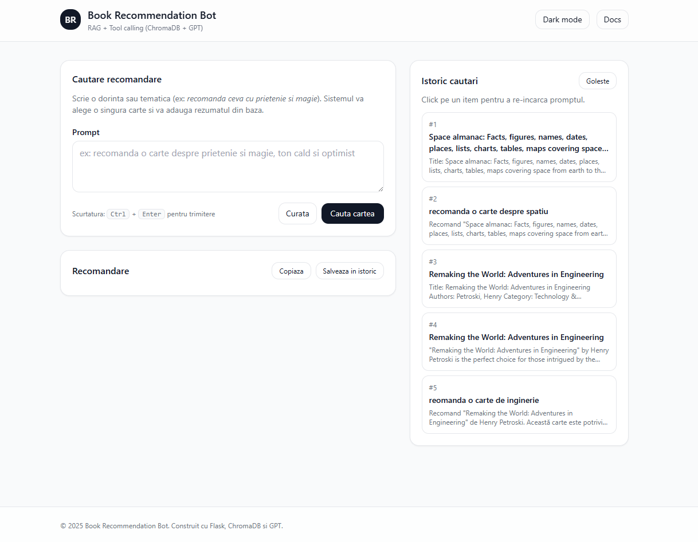

# Book Recommendation Bot



A personalized book recommendation application that provides tailored book suggestions based on user preferences and favorite genres.  
Powered by **Flask**, **ChromaDB**, and **OpenAI** for contextual recommendations.

---

## Features

- **Personalized Recommendations** — Enter your reading preferences and receive tailored suggestions  
- **Interactive Web Interface** — Built with Flask, HTML, CSS (Tailwind), and JavaScript  
- **Function Calling** — OpenAI model selects books and calls backend functions to return complete summaries  
- **Exact Title Bypass** — If you enter an exact title from the database, the app instantly returns its description (no API call needed)  
- **Scalable Vector Database** — ChromaDB manages embeddings and efficient semantic search  

---

## Installation

### Prerequisites
- Python 3.9 or newer  
- pip (Python package manager)

### Install Dependencies
```bash
pip install -r requirements.txt

Dataset – `books.csv`

The book dataset is too large to include in this repository directly. To run the project, please download it manually:

1. Visit the ["Books Dataset" on Kaggle by Elvin Rustam](https://www.kaggle.com/datasets/elvinrustam/books-dataset).  
2. Download the CSV version of the dataset.  
3. Decompress and place the file into the `data/` directory as `books.csv`.

Environment Variables
Create a .env file in the project root and add:

env
Copy code
OPENAI_API_KEY=your_openai_api_key
Build the Book Index
Before running the app, generate the ChromaDB index:

bash
Copy code
python main.py
This step loads data/books.csv and stores embeddings in the chromadb_data/ folder.

Run the Application
bash
Copy code
python app.py


Usage
Open the application in your browser

Enter in the search field:

A free-form prompt (e.g., recommend a book about friendship and magic)

Or an exact title from the database (e.g., Remaking the World: Adventures in Engineering)

Press the Search Book button or use Ctrl+Enter

Receive a recommendation with a complete description

View, copy, or save previous searches

Project Structure
bash
Copy code
book-recommendation-bot/
├── app.py                 # Flask app (UI + API)
├── main.py                # Script for indexing books in ChromaDB
├── data/
│   └── books.csv          # Book database
├── templates/
│   └── index.html         # HTML frontend
├── static/
│   ├── app.js             # UI logic
│   └── styles.css         # Custom styles
├── requirements.txt       # Python dependencies
├── .env                   # Local configuration (API keys, directories)
└── README.md              # Project documentation
Notes
The ChromaDB index only needs to be built once with main.py

Querying recommendations through the app does not re-consume tokens, unless new embeddings are created

For production use, run the app behind a WSGI server (e.g., Gunicorn) instead of Flask’s development server

yaml
Copy code

---
